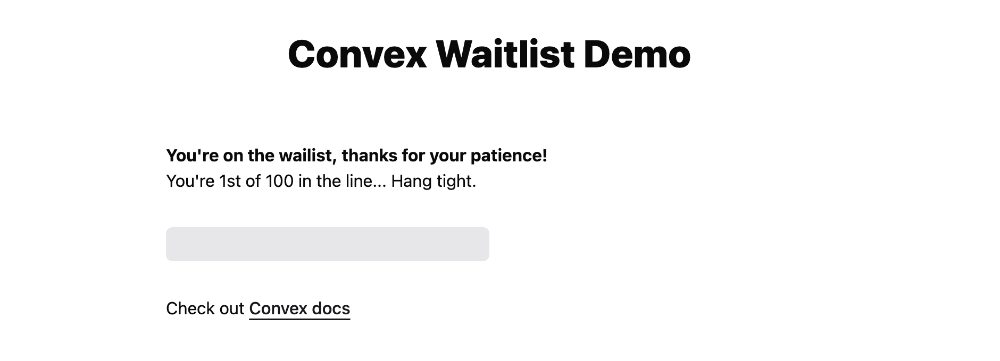

# Convex Waitlist

An easy to adopt waitlist implementation using [Convex](https://convex.dev).
Read the [detailed guide](https://stack.convex.dev/wait-a-minute-won-t-you) to
this implementation on Stack.



## Overview

This repo includes a full-fledged implementation of a waitlist which can be used
to protect your app against surges in demand.

- The `Waitlist` component renders a replacement UI when the user must wait
  before they can use the app, as demonstrated in [`App.tsx`](./src/App.tsx)
- The waitlist backend keeps track of sessions and the number of active
  sessions, as defined in
  [`convex/waitlist/schema.ts`](./convex/waitlist/schema.ts)
- The waitlist is updated periodically via a cron defined in
  [`convex/waitlist/crons.ts`](./convex/waitlist/crons.ts)
- The read endpoints powering the UI and all database queries are defined in
  [`convex/waitlist/read.ts`](./convex/waitlist/read.ts)
- The waitlist session creation and refresh logic is in
  [`convex/waitlist/write.ts`](./convex/waitlist/write.ts)

## Demo

You can play with the
[live demo](https://get-convex.github.io/convex-waitlist/). It's been configured
to allow only 3 users at a time to have access. You can open multiple browser
tabs to create multiple user sessions.

## Running the App

```
npm install
npm run dev
```

## Configuration

The implementation uses the following environment variables, which can be
configured on the Convex dashboard (run `npx convex dashboard` to open it):

- `ACTIVE_SESSIONS_COUNT_LIMIT` how many active (not-waiting) sessions there can
  be at the same time. Defaults to 100, but you should really change this based
  on the number of users your app can handle.
- `WAITLIST_UPDATE_INTERVAL_SECONDS` how often the waitlist should be updated
  based on active sessions becoming inactive. Defaults to every 60 seconds.
- `ACTIVE_SESSION_TIMEOUT_SECONDS` for how long an active session can be
  inactive before it expires. Defaults to 5 minutes. Make this shorter if your
  app is highly interactive and you want users to move off of the waitlist
  faster.
- `WAITING_SESSION_TIMEOUT_SECONDS` how long after a user waiting user leaves
  should their session expire. Defaults to 1 minute. Make this longer if you
  expect users to wait a long time and you want them to retain their position in
  the line.

## Adding waitlist to an existing app

1. Follow one of the Convex [quickstarts](https://docs.convex.dev/quickstarts)
   to get Convex set up.
   1. You don’t need to use Convex for anything else other than the waitlist
      (_but you really should_).
2. Copy the `convex/waitlist` folder from this repo into your `convex` folder
3. Set up crons. Adds the waitlist crons setup to your `convex/crons.ts` file:

   ```jsx
   import { cronJobs } from "convex/server";
   import { setupWaitlistCrons } from "./waitlist/crons";

   const crons = cronJobs();

   setupWaitlistCrons(crons);

   // ...your other crons, if any

   export default crons;
   ```

4. Set up the schema. Add the waitlist tables to your `convex/schema.ts` file:

   ```jsx
   import { defineSchema, defineTable } from "convex/server";
   import { waitlistTables } from "./waitlist/schema";

   export default defineSchema({
     ...waitlistTables,
     // ...your other tables, if any
   });
   ```

5. Protect your queries (read endpoints) by checking that the current session is
   active:

   ```jsx
   import { v } from "convex/values";
   import { query } from "./_generated/server";
   import { validateSessionIsActive } from "./waitlist/read";

   export const someRead = mutation({
     args: {
       // ... some arguments
       // any string will do as the user/session identifier
       sessionId: v.string(),
     },
     handler: async (ctx, args) => {
       // Check that the user is not still waiting
       await validateSessionIsActive(ctx, args.sessionId);

       // ... do whatever you need to do ...
     },
   });
   ```

6. Protect your mutations (write endpoints) by checking that the current session
   is active, and refresh the `lastActive` timestamp. See the
   [article](https://stack.convex.dev/wait-a-minute-won-t-you) for more details:

   ```jsx
   import { v } from "convex/values";
   import { mutation } from "./_generated/server";
   import { validateSessionAndRefreshLastActive } from "./waitlist/write";

   export const someWrite = mutation({
     args: {
       // ... some arguments
       // any string will do as the user/session identifier
       sessionId: v.string(),
     },
     handler: async (ctx, args) => {
       // Check that the user is not still waiting and
       // record that the user is actively using the app.
       await validateSessionAndRefreshLastActive(ctx, args.sessionId);

       // ... do whatever you need to do ...
     },
   });
   ```

7. Implement your UI. React is the simplest, but you could use another client if
   you’re willing to put in a little bit of time and effort.

   1. Copy the `src/waitlist` folder from this repo into your
      src/app/pages/lib/whatever client-side source folder
   2. Wrap your app in the `Waitlist` component, which takes the following
      props:
      - `loading` with what is shown while we’re loading the waitlist status
        from the server
      - `whileWaiting` to render the UI when the user is waiting
      - `sessionId` to identify the current user or session

   example:

   ```jsx
   import { Waitlist } from "./waitlist/Waitlist";

   export function App() {
     const sessionId = useSessionId();
     return (
       <Waitlist
         loading="Loading..."
         sessionId={sessionId}
         whileWaiting={(position, numWaiting) => (
           <p>
             You're on the wailist, thanks for your patience!
             <br />
             Your position in the line: {position} out of {numWaiting}.<br />
             Thanks for waiting.
           </p>
         )}
       >
         <p>You're no longer waiting! Congratz!</p>
       </Waitlist>
     );
   }
   ```

And you're done!

### Tracking activity for waiting sessions

If your app offers some server interaction to waiting users, you can track their
`lastActive` timestamp for more aggressive session timeout:

```jsx
import { v } from "convex/values";
import { mutation } from "./_generated/server";
import { refreshLastActive } from "./waitlist/write";

export const someWriteWhileWaiting = mutation({
  args: {
    // ... some arguments
    // any string will do as the user/session identifier
    sessionId: v.string(),
  },
  handler: async (ctx, args) => {
    // Record that the waiting user is actively using the app.
    await refreshLastActive(ctx, args.sessionId);

    // ... do whatever you need to do ...
  },
});
```

# What is Convex?

[Convex](https://convex.dev) is a hosted backend platform with a built-in
database that lets you write your
[database schema](https://docs.convex.dev/database/schemas) and
[server functions](https://docs.convex.dev/functions) in
[TypeScript](https://docs.convex.dev/typescript). Server-side database
[queries](https://docs.convex.dev/functions/query-functions) automatically
[cache](https://docs.convex.dev/functions/query-functions#caching--reactivity)
and [subscribe](https://docs.convex.dev/client/react#reactivity) to data,
powering a
[realtime `useQuery` hook](https://docs.convex.dev/client/react#fetching-data)
in our [React client](https://docs.convex.dev/client/react). There are also
[Python](https://docs.convex.dev/client/python),
[Rust](https://docs.convex.dev/client/rust),
[ReactNative](https://docs.convex.dev/client/react-native), and
[Node](https://docs.convex.dev/client/javascript) clients, as well as a
straightforward
[HTTP API](https://github.com/get-convex/convex-js/blob/main/src/browser/http_client.ts#L40).

The database support
[NoSQL-style documents](https://docs.convex.dev/database/document-storage) with
[relationships](https://docs.convex.dev/database/document-ids) and
[custom indexes](https://docs.convex.dev/database/indexes/) (including on fields
in nested objects).

The [`query`](https://docs.convex.dev/functions/query-functions) and
[`mutation`](https://docs.convex.dev/functions/mutation-functions) server
functions have transactional, low latency access to the database and leverage
our [`v8` runtime](https://docs.convex.dev/functions/runtimes) with
[determinism guardrails](https://docs.convex.dev/functions/runtimes#using-randomness-and-time-in-queries-and-mutations)
to provide the strongest ACID guarantees on the market: immediate consistency,
serializable isolation, and automatic conflict resolution via
[optimistic multi-version concurrency control](https://docs.convex.dev/database/advanced/occ)
(OCC / MVCC).

The [`action` server functions](https://docs.convex.dev/functions/actions) have
access to external APIs and enable other side-effects and non-determinism in
either our [optimized `v8` runtime](https://docs.convex.dev/functions/runtimes)
or a more
[flexible `node` runtime](https://docs.convex.dev/functions/runtimes#nodejs-runtime).

Functions can run in the background via
[scheduling](https://docs.convex.dev/scheduling/scheduled-functions) and
[cron jobs](https://docs.convex.dev/scheduling/cron-jobs).

Development is cloud-first, with
[hot reloads for server function](https://docs.convex.dev/cli#run-the-convex-dev-server)
editing via the [CLI](https://docs.convex.dev/cli). There is a
[dashbord UI](https://docs.convex.dev/dashboard) to
[browse and edit data](https://docs.convex.dev/dashboard/deployments/data),
[edit environment variables](https://docs.convex.dev/production/environment-variables),
[view logs](https://docs.convex.dev/dashboard/deployments/logs),
[run server functions](https://docs.convex.dev/dashboard/deployments/functions),
and more.

There are built-in features for
[reactive pagination](https://docs.convex.dev/database/pagination),
[file storage](https://docs.convex.dev/file-storage),
[reactive search](https://docs.convex.dev/text-search),
[https endpoints](https://docs.convex.dev/functions/http-actions) (for
webhooks),
[streaming import/export](https://docs.convex.dev/database/import-export/), and
[runtime data validation](https://docs.convex.dev/database/schemas#validators)
for [function arguments](https://docs.convex.dev/functions/args-validation) and
[database data](https://docs.convex.dev/database/schemas#schema-validation).

Everything scales automatically, and it’s
[free to start](https://www.convex.dev/plans).
